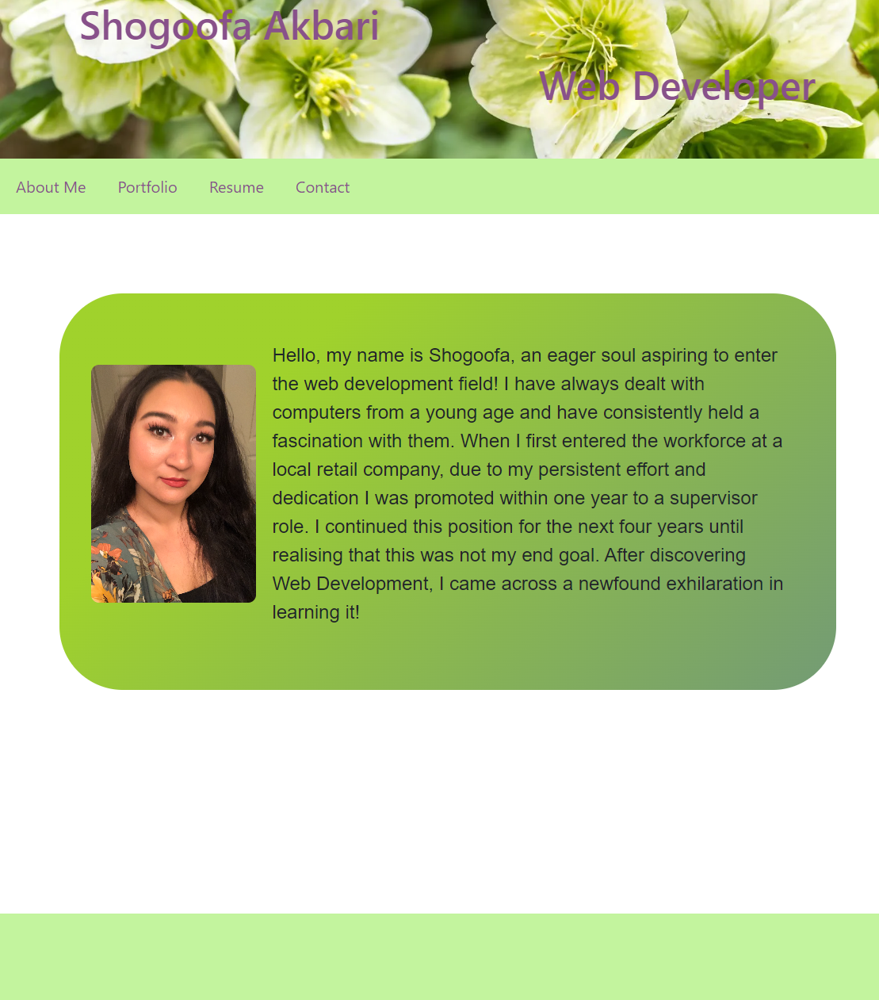

# React-Portfolio-SA 

## Description

In this react project I have resused my base Portfolio which was html/css only while altering it to fit Reacts front end language. The page will render the different tabs without having to reload.

# Table of Contents

- [Link](#link)

- [Screenshot](#Screenshot)

- [Licensing](#licensing)

# Screenshot

# Licensing

This project is licensed under the MIT license.

